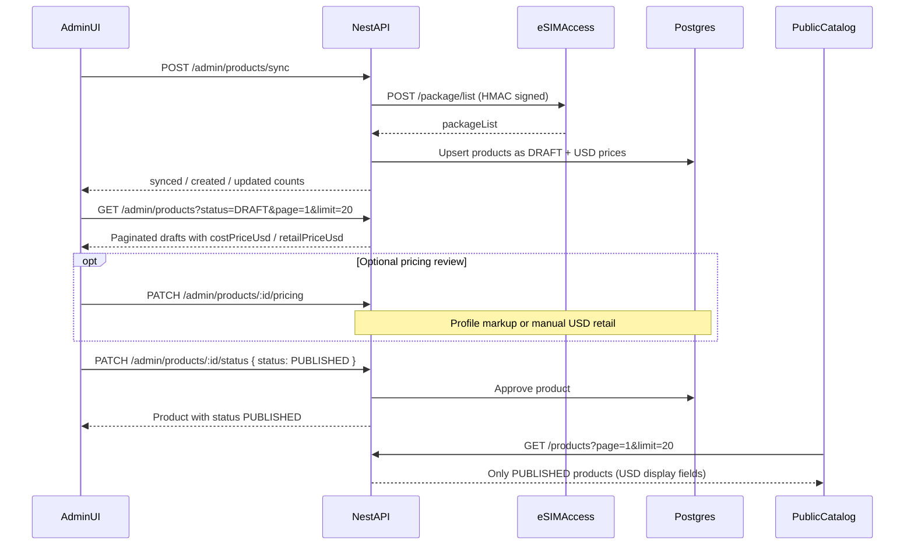
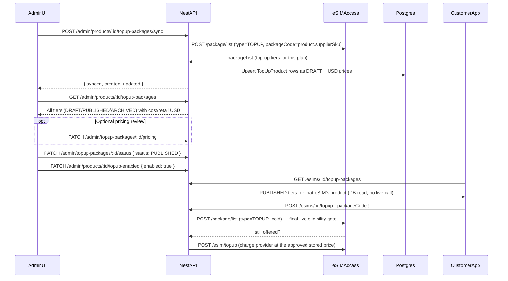

# Admin Product Sync → Pricing → Approval (Publish)

This document describes the **full TradeVero catalog lifecycle** for admins and frontend engineers: how supplier plans are synced, priced in USD, reviewed, and approved for the public store.

Base API: `/api/v1`  
Swagger: `http://localhost:3000/api/docs`  
Auth: Clerk Bearer JWT with admin role (`publicMetadata.role = "admin"` or Clerk org role `org:admin`)

---

## Concepts

| Concept | Meaning |
|--------|---------|
| **Supplier / provider** | eSIM Access. Source of wholesale packages. Never exposed raw to end users. |
| **Product** | TradeVero-owned catalog row (our model, our pricing, our status). |
| **DRAFT** | Synced but **not** for sale. Invisible on `GET /products`. |
| **PUBLISHED** | **Approved** for sale. Visible on the public catalog. |
| **ARCHIVED** | Removed from sale; kept for history. |
| **Cost price** | Wholesale cost in **USD** (converted from eSIM Access units ÷ 10,000). |
| **Retail price** | Customer-facing price in **USD**. |
| **Pricing profile** | Markup rule applied to cost → retail (`STANDARD`, `COMPETITIVE`, `PREMIUM`). |
| **Manual override** | Admin-set retail price that **survives** future syncs. |
| **Approval** | Setting status `DRAFT` → `PUBLISHED`. |

TradeVero is **wallet-first**: customers only buy **PUBLISHED** products with wallet balance. Syncing alone never puts a plan on the storefront.

---

## Status state machine

```text
                    POST /admin/products/sync
                              │
                              ▼
                         ┌─────────┐
                         │  DRAFT  │  ← default after sync
                         └────┬────┘
                              │
           PATCH status=PUBLISHED (approval)
                              │
                              ▼
                      ┌────────────┐
                      │ PUBLISHED  │  ← public GET /products
                      └─────┬──────┘
                            │
        ┌───────────────────┼───────────────────┐
        │                   │                   │
        ▼                   ▼                   ▼
   status=DRAFT      status=ARCHIVED     (stays PUBLISHED)
   (unpublish)         (retire)
```

---

## End-to-end flow (happy path)



### Regions (country search)

eSIM Access [`POST /location/list`](https://docs.esimaccess.com/#756ec9fa-d16e-4366-98a8-8bad806f9d1a) returns supported countries/regions (`code`, `name`, `type`, `subLocationList`). Admin sync stores them in `regions`.

| Endpoint | Purpose |
|----------|---------|
| `GET /api/v1/regions?q=Japan` | Autocomplete countries/regions by name or code |
| `GET /api/v1/products?country=Japan` | Find published products for that country (resolves name → codes) |
| `GET /api/v1/products?locationCode=JP` | Exact code filter |

`type` `1` = single country, `type` `2` = multi-country region (Europe, etc.). Searching `"Spain"` can also match regional plans that include Spain in `subLocations`.

**Frontend pattern:** typeahead on `GET /regions?q=` → user picks a row → load `GET /products?country={name}` or `?locationCode={code}`.

---

### Step 1 — Sync from supplier

```http
POST /api/v1/admin/products/sync
Authorization: Bearer <clerk_admin_jwt>
```

**What happens**

1. Syncs regions/countries from eSIM Access `POST /location/list` into `regions`.
2. Ensures default pricing profiles exist:
   - `STANDARD` → +30%
   - `COMPETITIVE` → +15%
   - `PREMIUM` → +50%
3. Calls eSIM Access `POST /package/list` with HMAC auth (`ESIM_ACCESS_CODE` + `ESIM_SECRET_KEY`).
4. For each package:
   - Convert provider price → USD: `costUsd = providerPrice / 10000`
   - Round cost to **2 decimal places**
   - Compute retail from **STANDARD** profile (unless product already has `manualOverride`)
   - **Create** new product as `DRAFT`, or **update** existing by `supplierSku` (`packageCode`)
5. Never auto-publishes.

**Response**

```json
{
  "synced": 420,
  "created": 12,
  "updated": 408
}
```

| Field | Meaning |
|-------|---------|
| `synced` | Packages returned by supplier |
| `created` | New DRAFT rows inserted |
| `updated` | Existing rows refreshed (cost/name/etc.) |

**Sync rules for existing products**

| Field | On re-sync |
|-------|------------|
| `name`, location, volume, duration, `costPrice` | Always updated |
| `retailPrice` | Recalculated from pricing profile **unless** `manualOverride = true` |
| `status` | **Unchanged** (a PUBLISHED product stays PUBLISHED) |
| `supplierSku` | Stable unique key |

---

### Step 2 — Review drafts (paginated)

```http
GET /api/v1/admin/products?status=DRAFT&page=1&limit=20
Authorization: Bearer <clerk_admin_jwt>
```

Optional filters:

| Query | Description |
|-------|-------------|
| `status` | `DRAFT` \| `PUBLISHED` \| `ARCHIVED` |
| `locationCode` | e.g. `US`, `JP` |
| `page` | 1-based page (default `1`) |
| `limit` | Page size 1–100 (default `20`) |

**Response shape**

```json
{
  "data": [
    {
      "id": "uuid",
      "name": "United States 5GB 30Days",
      "supplierSku": "US_5_30",
      "locationCode": "US",
      "dataVolumeBytes": "5368709120",
      "dataVolumeDisplay": "5 GB",
      "durationDays": 30,
      "costPrice": "1.38",
      "costPriceUsd": "$1.38",
      "retailPrice": "1.79",
      "retailPriceUsd": "$1.79",
      "currency": "USD",
      "status": "DRAFT",
      "manualOverride": false
    }
  ],
  "meta": {
    "page": 1,
    "limit": 20,
    "total": 120,
    "totalPages": 6,
    "hasNextPage": true,
    "hasPreviousPage": false
  }
}
```

**Price fields (USD)**

| Field | Use |
|-------|-----|
| `costPrice` / `retailPrice` | Decimal strings (`"1.79"`) for math / forms |
| `costPriceUsd` / `retailPriceUsd` | Display strings (`"$1.79"`) for UI |
| `currency` | Always `USD` in API responses |

Frontend should show **`retailPriceUsd`** / **`costPriceUsd`** in tables; submit numeric USD via `retailPrice` when overriding.

---

### Step 3 — Adjust pricing (optional, before or after publish)

#### A) Apply a pricing profile

```http
PATCH /api/v1/admin/products/:id/pricing
Authorization: Bearer <clerk_admin_jwt>
Content-Type: application/json

{
  "pricingProfileName": "COMPETITIVE"
}
```

Recalculates:

```text
retail = round(cost * (1 + markup%), 2)
```

Sets `manualOverride = false`.

#### B) Manual USD override

```http
PATCH /api/v1/admin/products/:id/pricing
Authorization: Bearer <clerk_admin_jwt>
Content-Type: application/json

{
  "retailPrice": 2.49,
  "manualOverride": true
}
```

- `retailPrice` is **US dollars** (not provider units, not cents).
- Future syncs will refresh cost/name but **keep** this retail price while `manualOverride` is true.

---

### Step 4 — Approve (publish)

```http
PATCH /api/v1/admin/products/:id/status
Authorization: Bearer <clerk_admin_jwt>
Content-Type: application/json

{
  "status": "PUBLISHED"
}
```

This is the **approval** action. After this:

- Product appears on public `GET /api/v1/products`
- Customers can purchase it with wallet balance via `POST /api/v1/orders`

#### Unpublish / revoke approval

```json
{ "status": "DRAFT" }
```

#### Retire

```json
{ "status": "ARCHIVED" }
```

---

### Step 5 — Public catalog (customer-facing)

```http
GET /api/v1/products?page=1&limit=20&locationCode=US
```

No auth required. Returns **only `PUBLISHED`** products, paginated, with USD display fields.

```json
{
  "data": [
    {
      "id": "uuid",
      "name": "United States 5GB 30Days",
      "locationCode": "US",
      "dataVolumeDisplay": "5 GB",
      "durationDays": 30,
      "retailPrice": "1.79",
      "retailPriceUsd": "$1.79",
      "currency": "USD",
      "status": "PUBLISHED"
    }
  ],
  "meta": {
    "page": 1,
    "limit": 20,
    "total": 45,
    "totalPages": 3,
    "hasNextPage": true,
    "hasPreviousPage": false
  }
}
```

Note: public responses **do not** include `costPrice`, `supplierSku`, or other wholesale fields.

---

## Frontend expectations (admin catalog)

This section is the **contract for the admin frontend**: screens, states, API wiring, and UX practices. Build against this so catalog ops are safe, fast, and hard to misuse.

### Goals

1. Sync supplier plans without accidentally putting them on the storefront.
2. Let admins review drafts, set USD prices, then **explicitly approve**.
3. Make pricing/margin obvious before publish.
4. Prevent double-sync, accidental publish, and silent failures.
5. Stay usable with hundreds of products (pagination + filters first-class).

### Access & auth (frontend)

| Expectation | Detail |
|-------------|--------|
| Route guard | Admin catalog lives under an admin-only area (e.g. `/admin/catalog`). |
| Role check | Only show nav if Clerk `publicMetadata.role === "admin"` (or org admin). Still rely on API `403` as source of truth. |
| Token | Every admin call: `Authorization: Bearer ${await getToken()}`. |
| 401 | Session expired → redirect to sign-in; toast “Session expired”. |
| 403 | Not admin → full-page “You don’t have access” (no empty table pretending to load). |
| First load | After admin login, optionally call `GET /users/me` once so local user exists (same as customer app). |

Do **not** store wholesale cost or admin lists in public storefront caches.

### Information architecture

Recommended routes / tabs:

| Screen | Purpose | Default API |
|--------|---------|-------------|
| **Catalog → Needs review** | Approval queue | `GET /admin/products?status=DRAFT&page=1&limit=20` |
| **Catalog → Live** | Published storefront items | `GET /admin/products?status=PUBLISHED&page=1&limit=20` |
| **Catalog → Archived** | Retired | `GET /admin/products?status=ARCHIVED&page=1&limit=20` |
| **Sync** | Action on toolbar (not a separate “dump everything” page) | `POST /admin/products/sync` |

Default landing tab: **Needs review (DRAFT)** — that is the work queue.

Optional top summary chips (derived from `meta.total` per status fetch or three lightweight counts):

- `Needs review: N`
- `Live: N`
- `Archived: N`

### Page layout (best practice)

```text
┌─────────────────────────────────────────────────────────────┐
│ Catalog                              [Sync from supplier]   │
│ Last sync: just now · 12 new · 408 updated                  │
├─────────────────────────────────────────────────────────────┤
│ [Needs review] [Live] [Archived]     Location ▾   Search…   │
├─────────────────────────────────────────────────────────────┤
│ Table…                                                      │
│ …                                                           │
├─────────────────────────────────────────────────────────────┤
│ Showing 1–20 of 120          [< Prev]  Page 1 of 6  [Next >]│
└─────────────────────────────────────────────────────────────┘
```

- One primary action in the header: **Sync from supplier**.
- Tabs map 1:1 to `status` filter; changing tab resets `page` to `1`.
- Filters (location) are secondary; keep them sticky across pages within a tab.

### Table columns (admin)

| Column | Source | UX notes |
|--------|--------|----------|
| Product | `name` | Primary text; truncate with tooltip for long names |
| Region | `locationCode` | Badge / flag optional |
| Data | `dataVolumeDisplay` | Prefer display string (`5 GB`), not raw bytes |
| Validity | `durationDays` | e.g. `30 days` |
| Cost | `costPriceUsd` | Muted; wholesale only |
| Retail | `retailPriceUsd` | Emphasized; editable affordance |
| Margin | computed | See below; color hint if low/negative |
| Override | `manualOverride` | Chip: `Manual` / `Auto` |
| Status | `status` | Badge: Draft / Live / Archived |
| SKU | `supplierSku` | Secondary / copyable; hide on mobile |
| Actions | — | Row menu: Edit price, Approve, Unpublish, Archive |

**Margin (client-computed):**

```ts
const cost = Number(product.costPrice);
const retail = Number(product.retailPrice);
const marginUsd = retail - cost;
const marginPct = cost > 0 ? (marginUsd / cost) * 100 : 0;
```

Display examples: `+$0.41 (30%)`. Warn visually if `marginUsd <= 0` or `marginPct < 10` before approve.

### Display money correctly

| Do | Don’t |
|----|-------|
| Show `retailPriceUsd` / `costPriceUsd` in tables | Invent your own `$` formatting from floats carelessly |
| Edit forms bind to `retailPrice` as number/`"2.49"` | Send provider units or cents |
| Keep 2 decimal places in inputs | Allow more than 2 decimals without rounding |
| Align currency columns right | Mix NGN/other currency labels |

Input pattern for manual price:

- Label: **Retail price (USD)**
- Prefix: `$`
- Placeholder: `2.49`
- Validate: `>= 0`, max 2 decimals
- Submit: `{ "retailPrice": 2.49, "manualOverride": true }`

### Sync UX (critical)

Sync can take several seconds (supplier round-trip + many upserts).

| State | UX |
|-------|-----|
| Idle | Button: **Sync from supplier** |
| Loading | Disable button; spinner + “Syncing packages…”; block second click |
| Success | Toast: `Synced {synced}: {created} new, {updated} updated`; refresh current tab; if `created > 0`, switch to **Needs review** and toast CTA “Review new drafts” |
| Error `502` | Toast: supplier unavailable; leave table as-is |
| Error `401/403` | Auth/access handling above |
| Timeout | Friendly retry message; never assume partial success without refetch |

**Best practices**

- Confirm only if a sync is already running client-side (“Sync already in progress”).
- Do **not** require a scary confirm dialog for every sync (low risk: never auto-publishes).
- After sync success, **refetch** list (`page` stays or reset to 1 for DRAFT when `created > 0`).
- Persist “last sync result” in session UI (counts + timestamp) above the table.
- Optionally debounce / cooldown (e.g. 10s) to avoid hammering the supplier.

### Pagination UX

Wire to API meta — do not invent client-only slicing of a full dump.

| Control | Behavior |
|---------|----------|
| Page size | Default `20`; allow `20 / 50 / 100` → `limit` |
| Prev / Next | Disabled via `hasPreviousPage` / `hasNextPage` |
| Page indicator | `Page {page} of {totalPages}` + `Showing X–Y of {total}` |
| Empty page | If `data.length === 0` and `total === 0` → empty state (below), not “error” |
| Filter change | Reset `page` to `1` |
| URL state | Prefer `?tab=draft&page=2&limit=20&locationCode=US` for share/refresh |

Loading: keep previous rows visible with a light overlay/skeleton on the table body (avoid full-page flash).

### Empty & loading states

| Situation | UI |
|-----------|-----|
| First visit, no products | Empty: “No products yet. Sync from supplier to import drafts.” + primary Sync button |
| DRAFT tab empty after sync | “All caught up — nothing waiting for approval.” Link to Live tab |
| Live tab empty | “Nothing published yet. Approve drafts to put plans on the storefront.” |
| Filter yields zero | “No products match these filters.” Clear filters action |
| Table loading | Skeleton rows (8–10) matching column layout |
| Row action loading | Disable that row’s buttons; optional spinner on the action |

### Edit price modal / drawer

**Trigger:** row “Edit price” or click retail cell.

**Contents**

1. Product name + region + data + cost (`costPriceUsd`, read-only).
2. Mode toggle:
   - **Pricing profile** → select `STANDARD` | `COMPETITIVE` | `PREMIUM` (show markup % helper text).
   - **Manual USD** → currency input.
3. Live preview: “Customers will see **$X.XX**” (from response after save, or optimistic calc for profile).
4. Actions: Cancel / Save price.

**On save**

- Profile mode → `PATCH .../pricing` `{ pricingProfileName }`
- Manual mode → `PATCH .../pricing` `{ retailPrice, manualOverride: true }`
- On success: update row in place; toast “Price updated”; close modal.
- If product is already `PUBLISHED`, show inline note: “This changes the live storefront price immediately.”

### Approve / unpublish / archive UX

| Action | Confirm? | Copy | API |
|--------|----------|------|-----|
| **Approve** | Yes (lightweight) | “Publish **{name}** for **{retailPriceUsd}**? Customers can buy it with wallet balance.” | `{ status: "PUBLISHED" }` |
| **Unpublish** | Yes | “Remove from storefront? Orders already sold are unaffected.” | `{ status: "DRAFT" }` |
| **Archive** | Yes (stronger) | “Archive **{name}**? It will leave the storefront and review queue.” | `{ status: "ARCHIVED" }` |

**Approve best practices**

- Disable Approve if retail is missing/zero or margin is negative — show why.
- After approve: remove row from DRAFT list (optimistic) or refetch; toast with link “View on Live”.
- Optional bulk later: not in API yet — do **one-by-one** for v1; don’t fake bulk in UI.
- Never auto-approve after sync.

### Row actions by tab

| Tab | Primary | Secondary |
|-----|---------|-----------|
| Needs review | **Approve** | Edit price |
| Live | Edit price | Unpublish, Archive |
| Archived | (read-only or Unarchive→DRAFT if you expose it) | — |

Use a single overflow menu (`⋯`) on mobile; show Approve as a visible button on desktop DRAFT rows.

### Filters & search (frontend)

| Filter | API today | UX |
|--------|-----------|-----|
| Status | `status` | Tabs (preferred over dropdown) |
| Location | `locationCode` | Dropdown; include “All regions” |
| Text | *Not in API yet* | Client-filter **current page only** is misleading — either omit search until backend supports it, or document as “local page filter” with a warning. Prefer omit for v1. |

### TypeScript shapes (frontend)

```ts
type ProductStatus = 'DRAFT' | 'PUBLISHED' | 'ARCHIVED';

type AdminProduct = {
  id: string;
  name: string;
  supplierSku: string;
  locationCode: string | null;
  dataVolumeBytes: string | null;
  dataVolumeDisplay: string | null;
  durationDays: number | null;
  costPrice: string;       // "1.38"
  costPriceUsd: string;    // "$1.38"
  retailPrice: string;     // "1.79"
  retailPriceUsd: string;  // "$1.79"
  currency: 'USD';
  status: ProductStatus;
  manualOverride: boolean;
  topUpEnabled: boolean; // see "Top-Up Catalog Management" below
};

type PaginatedAdminProducts = {
  data: AdminProduct[];
  meta: {
    page: number;
    limit: number;
    total: number;
    totalPages: number;
    hasNextPage: boolean;
    hasPreviousPage: boolean;
  };
};

type SyncResult = {
  synced: number;
  created: number;
  updated: number;
};
```

### Fetching patterns

```ts
// List
GET /api/v1/admin/products?status=DRAFT&page=1&limit=20&locationCode=US

// Sync
POST /api/v1/admin/products/sync

// Price – profile
PATCH /api/v1/admin/products/:id/pricing
{ "pricingProfileName": "STANDARD" }

// Price – manual USD
PATCH /api/v1/admin/products/:id/pricing
{ "retailPrice": 2.49, "manualOverride": true }

// Approve
PATCH /api/v1/admin/products/:id/status
{ "status": "PUBLISHED" }
```

**Caching**

- Admin lists: short staleTime (e.g. 15–30s) or invalidate on sync/price/status mutations.
- After any mutation on a row: update cache for that id or invalidate the active query key `(status, page, limit, locationCode)`.
- Do not share admin product queries with the public storefront query client keys.

### Error mapping (UI copy)

| Status | Suggested toast / inline |
|--------|---------------------------|
| `400` | Show API `message` (validation) |
| `401` | “Session expired. Sign in again.” |
| `403` | “Admin access required.” |
| `404` | “Product no longer exists.” Refetch list |
| `502` (sync) | “Supplier unavailable. Try again in a few minutes.” |
| Network | “Connection lost. Check your network and retry.” |

Always surface server `message` when present (backend no longer hides Clerk/auth causes behind opaque text on other routes either).

### Accessibility & polish

- Buttons have clear labels (“Approve product”, not only an icon).
- Confirm dialogs focus trap; Esc cancels.
- Toasts are announcements (`aria-live`).
- Tables: header scope, row actions keyboard reachable.
- Don’t rely on color alone for margin warnings (include text/icon).
- Mobile: card list fallback instead of tiny 10-column table.

### UX anti-patterns (avoid)

- Auto-publishing after sync.
- Loading **all** products into memory and paginating only in the browser.
- Showing cost price on the customer storefront.
- Using `retailPriceUsd` (`"$1.79"`) as the PATCH body value.
- Silent sync failure (spinner stops, no toast).
- Approve with no price confirmation.
- Bulk checkboxes that call N publishes with no progress UI (wait for real bulk API).

### Frontend acceptance checklist

- [ ] Non-admin cannot open catalog (UI guard + API 403 handled).
- [ ] Sync disables button, shows progress, toasts counts, refreshes DRAFT when `created > 0`.
- [ ] DRAFT / PUBLISHED / ARCHIVED tabs use `status` + server pagination.
- [ ] Table shows `costPriceUsd`, `retailPriceUsd`, margin, `manualOverride`.
- [ ] Edit price supports profile + manual USD; save updates row.
- [ ] Approve requires confirm and uses `status: PUBLISHED`.
- [ ] Unpublish / Archive confirm and correct status payloads.
- [ ] Empty, loading, and error states are all intentional.
- [ ] Money always treated as USD; 2 decimal places in inputs.
- [ ] Mutations invalidate/refetch the active list query.

---

## Top-Up Catalog Management (curated top-ups)

Top-ups (adding data/validity to an **already-sold, already-installed** eSIM) used to be
quoted live from the supplier on every customer request. They're now a **curated catalog**
(`TopUpProduct`), managed with the exact same sync → review → price → approve lifecycle as
base products above — just scoped **per base Product** instead of a single global sync.

This closes the gap of "half-live" top-up pricing: admins now see and approve top-up prices
before customers ever see them, and can kill top-ups for a plan entirely with one toggle.

### Concepts

| Concept | Meaning |
|--------|---------|
| **TopUpProduct** | A top-up tier (e.g. "+1GB / 30 days") tied to one base `Product`. Same DRAFT/PUBLISHED/ARCHIVED lifecycle, own cost/retail price. |
| **`Product.topUpEnabled`** | Kill switch on the **base** product. Default `false`. Even with `PUBLISHED` `TopUpProduct` rows, customers see zero top-up options while this is off. |
| **Per-product sync** | Unlike base catalog sync (one global pull), top-ups are synced **one base product at a time** — "check top-up prices" is a row-level action, not a blanket operation. |
| **Final live gate (no admin action)** | Even after you publish a tier, the API still makes one live provider call *at charge time*, scoped to the customer's specific eSIM, to confirm that instance is still eligible (validity window, provider top-up cap, etc.). This is automatic and invisible to admins — it never blocks what you publish, only what an individual eSIM can redeem right now. |

### Endpoints

| Method | Path | Purpose |
|--------|------|---------|
| `POST` | `/admin/products/:id/topup-packages/sync` | "Check top-up prices" — pull tiers for this product from the supplier |
| `GET` | `/admin/products/:id/topup-packages` | Review tiers for this product (all statuses) |
| `PATCH` | `/admin/topup-packages/:id/status` | Publish / unpublish / archive a tier |
| `PATCH` | `/admin/topup-packages/:id/pricing` | Set pricing profile or manual USD retail price |
| `PATCH` | `/admin/products/:id/topup-enabled` | Turn top-ups on/off for this product's eSIMs |

`:id` on the first, second, and last routes is the **base Product id** (same id as
`GET /admin/products`). `:id` on the two `/admin/topup-packages/:id/...` routes is the
`TopUpProduct` id from the sync/list response.

### Flow



### Step 1 — Sync top-up tiers for a product

```http
POST /api/v1/admin/products/:id/topup-packages/sync
Authorization: Bearer <clerk_admin_jwt>
```

**What happens**

1. Looks up the base `Product` by `:id` and reads its `supplierSku` (the packageCode).
2. Calls eSIM Access `POST /package/list` with `type=TOPUP`, `packageCode=<supplierSku>` —
   **no iccid / live eSIM required**, this works the moment a base product exists.
3. For each tier: converts price to USD, computes retail from **STANDARD** profile (unless
   `manualOverride`), and upserts by `(productId, packageCode)`.
4. Never auto-publishes and never touches `Product.topUpEnabled`.

**Response** — `TopUpSyncResultDto`:

```json
{ "synced": 4, "created": 4, "updated": 0 }
```

An empty/zero result means this product's plan has no top-up tiers on the supplier side —
that's a normal, valid outcome (not every plan is top-up-able).

### Step 2 — Review tiers

```http
GET /api/v1/admin/products/:id/topup-packages
Authorization: Bearer <clerk_admin_jwt>
```

**Response** — array of `TopUpProductResponseDto`:

```json
[
  {
    "id": "uuid",
    "productId": "uuid",
    "packageCode": "TOPUP-EU-1GB",
    "name": "1GB Top-Up",
    "dataVolumeBytes": "1073741824",
    "dataVolumeDisplay": "1 GB",
    "durationDays": 30,
    "costPrice": "1.10",
    "costPriceUsd": "$1.10",
    "retailPrice": "1.43",
    "retailPriceUsd": "$1.43",
    "currency": "USD",
    "status": "DRAFT",
    "manualOverride": false
  }
]
```

### Step 3 — Adjust pricing (same shape as base products)

```http
PATCH /api/v1/admin/topup-packages/:id/pricing
Authorization: Bearer <clerk_admin_jwt>
Content-Type: application/json

{ "pricingProfileName": "COMPETITIVE" }
```

or a manual override:

```json
{ "retailPrice": 1.99, "manualOverride": true }
```

Same rules as base product pricing: manual overrides survive future syncs of this tier.

### Step 4 — Publish the tier

```http
PATCH /api/v1/admin/topup-packages/:id/status
Authorization: Bearer <clerk_admin_jwt>
Content-Type: application/json

{ "status": "PUBLISHED" }
```

A `PUBLISHED` tier is a candidate for customers to see — but only once the **base product's**
`topUpEnabled` toggle (next step) is also on.

### Step 5 — Turn top-ups on for the product

```http
PATCH /api/v1/admin/products/:id/topup-enabled
Authorization: Bearer <clerk_admin_jwt>
Content-Type: application/json

{ "enabled": true }
```

**This is the master switch.** Recommended order: sync → review/price → publish at least one
tier → *then* flip this on. Flipping it on with zero `PUBLISHED` tiers is harmless (customers
just see an empty top-up list) but not useful — the UI should nudge admins to publish first.

Turning it back to `{ "enabled": false }` instantly hides top-ups for that product's eSIMs
again, without touching the tiers themselves (nothing is deleted or unpublished).

### Frontend UX for top-up management

Add this as a **secondary tab/drawer on each base product** in the admin catalog (not a
separate top-level nav item) — top-ups only make sense in the context of their parent plan.

| Element | Behavior |
|---------|----------|
| Product row/detail | Add a "Top-ups" tab next to the main details, plus a small badge (e.g. `Top-ups: On · 3 published`) so admins don't have to open the tab to know the state |
| Top-ups tab, empty | "No top-up tiers yet." + **Check top-up prices** button → calls sync |
| Top-ups tab, has tiers | Table: Name, Data, Validity, Cost, Retail, Margin, Status, Actions (same column conventions as the base catalog table) |
| Master toggle | Prominent switch: **"Top-ups enabled for this product"** — off by default, confirm before turning on if zero published tiers exist ("You haven't published any top-up tiers yet — customers will see nothing. Continue?") |
| Re-sync | "Check top-up prices" is safe to click anytime (upsert, never auto-publish); show the same synced/created/updated toast pattern as base sync |
| Publish tier | Same confirm copy pattern as base product approve: "Publish **{name}** for **{retailPriceUsd}**?" |

### TypeScript shapes

```ts
type TopUpProduct = {
  id: string;
  productId: string;
  packageCode: string;
  name: string;
  dataVolumeBytes: string | null;
  dataVolumeDisplay: string | null;
  durationDays: number | null;
  costPrice: string;
  costPriceUsd: string;
  retailPrice: string;
  retailPriceUsd: string;
  currency: 'USD';
  status: ProductStatus;
  manualOverride: boolean;
};

type TopUpSyncResult = {
  synced: number;
  created: number;
  updated: number;
};
```

`AdminProduct` (defined earlier) already carries the `topUpEnabled` field used by the
master toggle above.

### Error / edge cases (top-ups)

| Situation | Behavior |
|-----------|----------|
| Sync a product with no top-up tiers on the supplier | `200` with `{ synced: 0, created: 0, updated: 0 }` — not an error |
| Publish/price/enable an unknown id | `404` |
| Customer requests top-ups, `topUpEnabled = false` | `GET /esims/:id/topup-packages` returns `[]` (not an error) |
| Customer buys a `PUBLISHED` tier, but the live per-eSIM check fails at charge time | `400` from `POST /esims/:id/topup` — the tier stays published, only that specific charge attempt is rejected |
| Re-sync after publish | Status stays `PUBLISHED`; price updates only if not `manualOverride` (same as base products) |

---

## Pricing profiles (defaults)

| Profile | Rule | Example cost `$1.00` |
|---------|------|----------------------|
| `STANDARD` | +30% | `$1.30` |
| `COMPETITIVE` | +15% | `$1.15` |
| `PREMIUM` | +50% | `$1.50` |

New syncs assign **STANDARD** to brand-new products. Admins can change profile or set a manual dollar price before publishing.

---

## Auth requirements

| Endpoint | Auth |
|----------|------|
| `POST /admin/products/sync` | Clerk JWT + admin |
| `GET /admin/products` | Clerk JWT + admin |
| `PATCH /admin/products/:id/pricing` | Clerk JWT + admin |
| `PATCH /admin/products/:id/status` | Clerk JWT + admin |
| `POST /admin/products/:id/topup-packages/sync` | Clerk JWT + admin |
| `GET /admin/products/:id/topup-packages` | Clerk JWT + admin |
| `PATCH /admin/products/:id/topup-enabled` | Clerk JWT + admin |
| `PATCH /admin/topup-packages/:id/status` | Clerk JWT + admin |
| `PATCH /admin/topup-packages/:id/pricing` | Clerk JWT + admin |
| `GET /products` | Public |
| `GET /products/:id` | Public (published only) |
| `GET /esims/:id/topup-packages` | Clerk JWT (customer, owns the eSIM) |

Admin detection (Clerk source of truth):

- `publicMetadata.role === "admin"`, or
- JWT `org_role` is `org:admin` / `admin`

Set admin in Clerk Dashboard → Users → Public metadata:

```json
{ "role": "admin" }
```

---

## Environment (supplier sync)

```env
ESIM_ACCESS_CODE=...
ESIM_SECRET_KEY=...
ESIM_BASE_URL=https://api.esimaccess.com
```

HMAC signing is documented in [`esimapiauth.md`](./esimapiauth.md).

---

## Error / edge cases

| Situation | Behavior |
|-----------|----------|
| Sync while eSIM Access is down | `502` Bad Gateway; catalog unchanged |
| Publish unknown id | `404` Product not found |
| Non-admin calls admin routes | `403` Admin access required |
| Manual price set, then sync | Cost updates; retail stays if `manualOverride` |
| Re-sync after publish | Status stays `PUBLISHED`; storefront price updates only if not manually overridden |
| Empty page beyond `totalPages` | `data: []`, `meta.total` still correct |

---

## API quick reference

| Method | Path | Purpose |
|--------|------|---------|
| `POST` | `/admin/products/sync` | Pull supplier → DRAFT upsert |
| `GET` | `/admin/products?status=&page=&limit=` | Review queue (paginated) |
| `PATCH` | `/admin/products/:id/pricing` | Profile or manual USD price |
| `PATCH` | `/admin/products/:id/status` | **Approve** (`PUBLISHED`) / unpublish / archive |
| `POST` | `/admin/products/:id/topup-packages/sync` | "Check top-up prices" for one product |
| `GET` | `/admin/products/:id/topup-packages` | Review top-up tiers for one product |
| `PATCH` | `/admin/topup-packages/:id/pricing` | Profile or manual USD price for a top-up tier |
| `PATCH` | `/admin/topup-packages/:id/status` | Publish / unpublish / archive a top-up tier |
| `PATCH` | `/admin/products/:id/topup-enabled` | Master on/off switch for a product's top-ups |
| `GET` | `/products?page=&limit=&locationCode=` | Public published catalog |
| `GET` | `/products/:id` | Public product detail |
| `GET` | `/esims/:id/topup-packages` | Customer: published top-up tiers for their eSIM |
| `POST` | `/esims/:id/topup` | Customer: charge wallet + queue a top-up |

---

## Definition of done (approval complete)

A product is fully live when all are true:

1. Row exists in DB (via sync or prior create).
2. `retailPrice` is correct in USD (profile or manual).
3. `status === PUBLISHED`.
4. It appears in `GET /products` with `retailPriceUsd` like `"$1.79"`.
5. An authenticated customer with wallet balance can `POST /orders` with that `productId`.

Top-ups for that product are additionally live (optional, separate from the base product
going live) when all are true:

1. `POST /admin/products/:id/topup-packages/sync` has been run at least once.
2. At least one `TopUpProduct` row has `status === PUBLISHED` with correct `retailPrice`.
3. `Product.topUpEnabled === true`.
4. An owner of an eSIM sold under that product sees tiers in `GET /esims/:id/topup-packages`
   and can successfully `POST /esims/:id/topup`.
