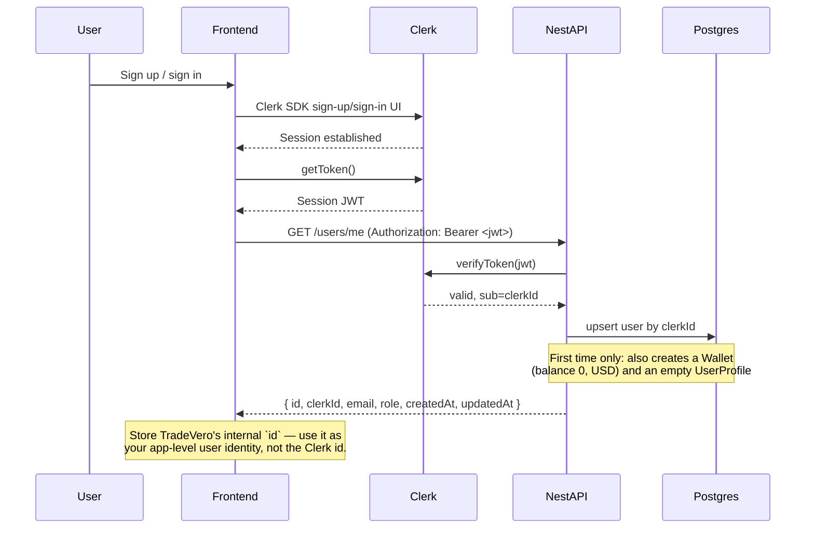

# Frontend Guide — Signup/Login & Profile

This document covers the two things every TradeVero frontend needs to get right first:
how a user goes from "opens the app" to "has a synced account + wallet", and how the
custom profile page (display name, phone, avatar, preferences, etc.) works.

Base API: `/api/v1`
Swagger: `<API_URL>/api/docs`

---

## The core idea

**Clerk owns identity. TradeVero's database owns everything else.**

| Belongs to | Data |
|---|---|
| **Clerk** | Email, password/OAuth, session, `role` claim (for admin checks) |
| **TradeVero DB** | Internal user id, wallet, orders, eSIMs — and now **custom profile data** (display name, phone, country, avatar, preferences, anything else) |

There is **no `/signup` or `/login` endpoint on this API.** Clerk handles sign-up/sign-in
entirely on the frontend. The backend's job starts the moment you have a Clerk session:
it verifies the token, then **upserts** a local `user` row keyed by Clerk's user id
(`clerkId`). This is why custom profile fields deliberately live in Postgres and not in
Clerk's `publicMetadata` — it keeps your data queryable and portable, and avoids Clerk's
metadata size/rate limits for something that's really just app data.

---

## Part 1 — Signup / Login flow

### Sequence



### Step by step

1. **Sign up or sign in** using the Clerk SDK on the frontend (`@clerk/nextjs`,
   `@clerk/clerk-react`, etc.) — hosted components or your own UI, either works. This is
   100% Clerk; the backend is not involved yet.
2. **Get the session token**: `const token = await getToken()`.
3. **Call `GET /users/me`** with `Authorization: Bearer <token>`. Do this once, right
   after login, before touching wallet/orders/payments.
4. **On first successful call**, the backend:
   - Verifies the JWT with Clerk.
   - Creates the local `user` row (`clerkId`, `email`, `role`).
   - Creates a `wallet` (balance `0`, currency `USD`).
   - Creates an empty `profile` row (see Part 2).
5. **On every later call**, it just refreshes `email`/`role` from Clerk and returns the
   same user — cheap, idempotent, safe to call on every app load.
6. Use the response's **`id`** (TradeVero's internal UUID) as your app-level user
   identity for anything you store client-side (not the Clerk id).

### Auth header for every protected request

```ts
const token = await getToken();
fetch(`${API_URL}/api/v1/...`, {
  headers: { Authorization: `Bearer ${token}` },
});
```

`getToken()` returns a short-lived JWT — call it fresh per-request (or use your Clerk
SDK's fetch wrapper if it has one) rather than caching it yourself.

### `GET /users/me` response

```json
{
  "id": "b3f1a2e4-...",
  "clerkId": "user_2abc...",
  "email": "ada@example.com",
  "role": "USER",
  "createdAt": "2026-08-08T10:00:00.000Z",
  "updatedAt": "2026-08-08T10:00:00.000Z"
}
```

| Field | Notes |
|---|---|
| `id` | **Use this** everywhere in your app (wallet, orders, eSIMs are all keyed to it) |
| `clerkId` | Clerk's `sub` — rarely needed directly on the frontend |
| `role` | `USER` \| `ADMIN`. Denormalized cache of the Clerk role claim — gate UI on it, but the backend re-checks Clerk on every admin request, so don't treat this alone as a security boundary |

### Error handling

| Status | Meaning | UI |
|---|---|---|
| `401` | Missing/invalid/expired Clerk token, or Clerk user has no email | Redirect to sign-in |
| `403` (on admin routes only) | Authenticated, but not an admin | "Access denied" |

A `401` here almost always means the token expired or wasn't attached — refresh via
`getToken()` and retry once before bouncing to sign-in.

### Common pitfall: new frontend origin → `azp` error

If you deploy the frontend to a new domain (Vercel preview, custom domain, etc.) and see:

```
Invalid JWT Authorized party claim (azp) "https://your-app.com". Expected "...".
```

That's not a frontend bug — the backend maintains an allow-list of trusted frontend
origins (`CLERK_AUTHORIZED_PARTIES`). Ask whoever manages the backend deployment to add
your origin to that env var. Nothing to change on the frontend.

---

## Part 2 — Profile page flow

Once `GET /users/me` has run at least once (so the user + empty profile exist), the
profile page is a straightforward read/edit screen against its own pair of endpoints —
separate from `/users/me`, which stays Clerk-identity-only.

| Method | Path | Purpose |
|---|---|---|
| `GET` | `/users/me/profile` | Fetch the current user's custom profile |
| `PATCH` | `/users/me/profile` | Update one or more profile fields |

### Fields

| Field | Type | Notes |
|---|---|---|
| `displayName` | `string \| null` | Max 120 chars |
| `phone` | `string \| null` | Max 32 chars, no format enforced (validate/format client-side for display) |
| `country` | `string \| null` | 2-letter ISO country code, e.g. `"NG"`, `"US"` |
| `avatarUrl` | `string \| null` | URL to a profile picture (upload the image elsewhere — e.g. your own storage/CDN — and save the resulting URL here) |
| `dateOfBirth` | `string \| null` (ISO date, e.g. `"1990-05-15"`) | Returned as an ISO datetime string |
| `preferences` | `object \| null` | Structured settings you define (notifications, language, display currency, etc.) |
| `metadata` | `object \| null` | Free-form bucket for anything else — no schema changes needed to add new keys here |

**Important: `preferences` and `metadata` are full replaces, not merges.** If you
`PATCH` with `{ "preferences": { "language": "fr" } }` and the existing value was
`{ "language": "en", "notifyByEmail": true }`, the result is just `{ "language": "fr" }`
— `notifyByEmail` is gone. Always send the **complete** object for whichever of these
two keys you're updating: read the current value first (from `GET`), merge client-side,
then `PATCH` the merged object.

### Fetching the profile

```ts
const res = await fetch(`${API_URL}/api/v1/users/me/profile`, {
  headers: { Authorization: `Bearer ${token}` },
});
const profile = await res.json();
```

```json
{
  "id": "9f2c...",
  "displayName": null,
  "phone": null,
  "country": null,
  "avatarUrl": null,
  "dateOfBirth": null,
  "preferences": null,
  "metadata": null,
  "createdAt": "2026-08-08T10:00:00.000Z",
  "updatedAt": "2026-08-08T10:00:00.000Z"
}
```

Freshly-created users get an all-`null` profile (except `id`/timestamps) — treat that as
"no profile filled in yet" in your empty-state UI, not an error.

### Updating the profile

```ts
await fetch(`${API_URL}/api/v1/users/me/profile`, {
  method: 'PATCH',
  headers: {
    Authorization: `Bearer ${token}`,
    'Content-Type': 'application/json',
  },
  body: JSON.stringify({
    displayName: 'Ada Lovelace',
    country: 'NG',
    preferences: { language: 'en', notifyByEmail: true },
  }),
});
```

- It's a **partial update** — omit any field you don't want to touch (except the
  `preferences`/`metadata` full-replace caveat above).
- Returns the full updated profile — update your local state from the response rather
  than assuming the request body.
- `dateOfBirth` must be sent as an ISO date string (`"1990-05-15"`); a native `<input
  type="date">` value is already in this format.

### Recommended UI flow

```
1. On profile page mount: GET /users/me/profile
   → populate a form; show skeleton while loading

2. User edits fields, hits Save
   → if editing preferences/metadata: merge with the last-fetched object client-side
     before sending (see note above)
   → PATCH /users/me/profile with only the changed top-level fields
   → on success: replace local state with the response, toast "Profile updated"
   → on 400 (validation): show field-level errors from the response `message` array

3. Avatar upload (if supported):
   → upload the image file to your own storage/CDN first
   → PATCH { "avatarUrl": "<resulting URL>" }
   → this API does not accept file uploads directly
```

### TypeScript shapes

```ts
type UserRole = 'USER' | 'ADMIN';

type TradeVeroUser = {
  id: string;
  clerkId: string;
  email: string;
  role: UserRole;
  createdAt: string;
  updatedAt: string;
};

type UserProfile = {
  id: string;
  displayName: string | null;
  phone: string | null;
  country: string | null;
  avatarUrl: string | null;
  dateOfBirth: string | null;
  preferences: Record<string, unknown> | null;
  metadata: Record<string, unknown> | null;
  createdAt: string;
  updatedAt: string;
};

type UpdateUserProfileInput = Partial<{
  displayName: string;
  phone: string;
  country: string;
  avatarUrl: string;
  dateOfBirth: string; // ISO date
  preferences: Record<string, unknown>;
  metadata: Record<string, unknown>;
}>;
```

### Error mapping (profile endpoints)

| Status | Cause | UI |
|---|---|---|
| `400` | Validation failed (e.g. `displayName` > 120 chars, `avatarUrl` not a valid URL, `dateOfBirth` not a valid date) | Show `message` array from the response, field by field if possible |
| `401` | Token missing/expired | Redirect to sign-in |

---

## Why this split (for context, not action needed)

- **Clerk stays thin**: identity + a `role` claim used for authorization decisions. That's
  the only data that benefits from living in the JWT/Clerk's system.
- **Everything else lives in Postgres**: queryable, joinable with orders/wallet for
  admin tooling, no Clerk API rate limits or size caps, and — the reason this split
  exists — if the auth provider ever changes, only the `clerkId` mapping needs touching.
  Every user's profile, wallet, and order history stays exactly where it is.
- **`metadata` is intentionally schema-less**: add new keys from the frontend at any
  time without waiting on a backend migration. Once a field proves itself worth
  indexing/validating properly, it graduates to a real column (like `displayName`/`phone`
  did) in a future migration.
